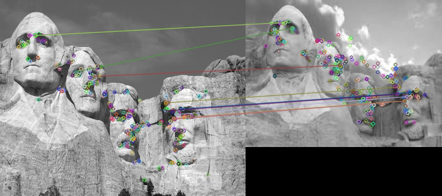

# Feature-Matching

Feature Matching is a very important concept in image processing used to compare 2 images to see if they are same object with a different orientation and imaging conditions or not.

### Process of performing this operation:

Firstly, we identify key points in both the images and each key-points associated has a descriptor. The descriptors are basically some arrays or other strings defining those key-points. Once we obtain the key points for each of these we see the top few closest match for the desriptors, which gives us an idea if they are the same or not.

The descriptors depend on the type of algorithm that is chosen for detection. Each algorithm has a different way of representing the features.

Some of the most popular algorithms for key point detection are SIFT(scale-invariant feature transfer), SURF(Speeded-Up Robust features) and ORB(Oriented FAST and Rotated BRIEF).

Below there we show how the matches are done even though both are images are differently oriented and have different lighting.

This is the matching that is done with the closely matching descriptors:

We can see how the algorithms can still match the features well even though the images are so different.
